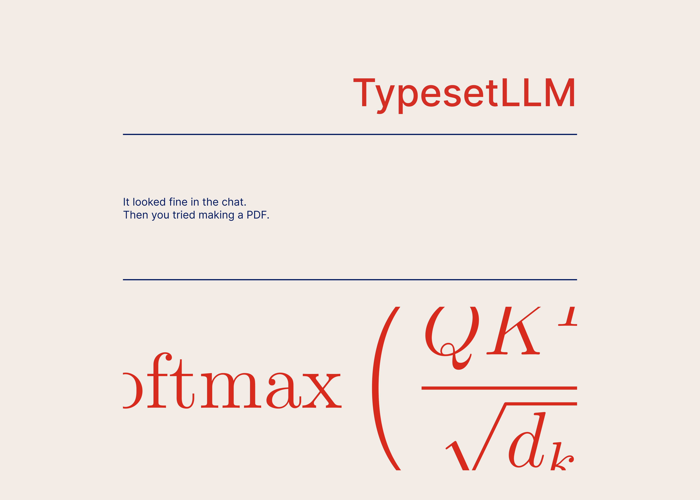
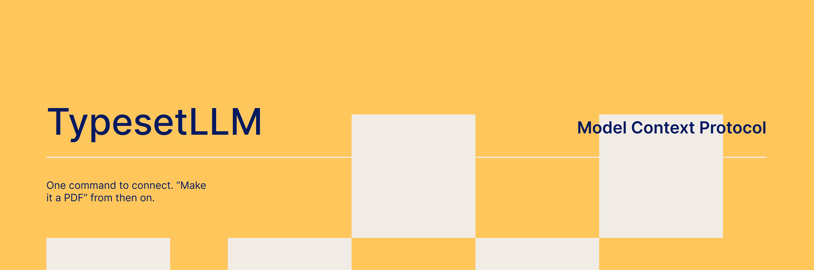

# TypesetLLM

TypesetLLM turns Markdown into a PDF using a bundled LaTeX template. It is for people who write reports, notes, or technical documents in Markdown and want a PDF without editing LaTeX directly. You can render a local file from the command line, paste text into the web app, call the HTTP API, or connect an MCP client.

## How rendering works

The command line tool passes Markdown to Pandoc. Pandoc parses the document, runs [the table filter](filters/content-aware-tables.lua), and builds LaTeX using [the vintage template](templates/vintage.tex). XeLaTeX turns that LaTeX into a PDF using the bundled [fonts](fonts/). The web app, API, and hosted MCP tool use the same renderer through [src/conversion.py](src/conversion.py); the web paths disable Pandoc's raw TeX input extension by default.

The repository includes one template, `vintage`. An unknown API `theme` currently falls back to it.

## Run locally

You need Python 3.11 or newer, Pandoc, XeLaTeX, and the LaTeX packages used by the template. The [Dockerfile](Dockerfile) installs the system tools and fonts used by the service. On macOS or Linux, after installing Pandoc and a TeX distribution with XeLaTeX:

```sh
python3 -m venv .venv
. .venv/bin/activate
python -m pip install -r requirements.txt
python -m src.smoke
```

The smoke command renders a short document. If it reports a missing `.sty` file, install that package in your TeX distribution and retry. Then start the local web app:

```sh
python run_local.py
```

Open <http://localhost:8000>. The process listens on `0.0.0.0:8000` by default; set `HOST` and `PORT` to change that.

To convert a file without starting the server:

```sh
./convert.sh sample.md sample.pdf
# or
python -m src.cli sample.md -o sample.pdf
```

The CLI also accepts `--stdin`, `--template`, and `--markdown-format`; run `python -m src.cli --help` for the options. The CLI enables Pandoc's raw TeX extension for trusted local input.

You can run the service in Docker instead of installing Pandoc and TeX locally:

```sh
docker build -t typesetllm .
docker run --rm -p 8000:8000 typesetllm
```

[render.yaml](render.yaml) contains the Render service configuration. A local Docker build does not verify a remote deployment.

## Hosted app and API

The configured public URL is <https://typesetllm.onrender.com/>. The browser app accepts Markdown and offers a PDF download and preview. The integration page is at `/integrations`. Service availability depends on that deployment; `/ready` reports whether its renderer passed the startup smoke check, while `/health` checks only the process.

The local and hosted HTTP API accept JSON, form data, or a raw Markdown body at `POST /convert`. For example, with the local server running:

```sh
curl -f http://localhost:8000/convert \
  -H 'Content-Type: application/json' \
  -d '{"markdown_text":"# Hello"}' \
  --output hello.pdf
```

Successful responses are PDFs. Rendering warnings, such as missing images or unsupported glyphs, are returned in the `X-Typeset-Warnings` header. The default request cap is 1 MiB. A request can wait up to 45 seconds for a renderer slot, and the Pandoc process then has its own 45-second timeout. The default rate limit is 60 conversions per client address per hour. These values are configured with `MAX_REQUEST_BYTES`, `CONVERSION_TIMEOUT_SECONDS`, and `CONVERSION_RATE_LIMIT_PER_HOUR`; `MAX_CONCURRENT_CONVERSIONS` defaults to 1.



## MCP clients

The hosted Streamable HTTP MCP endpoint is configured at <https://typesetllm.onrender.com/mcp>. For Codex:

```sh
codex mcp add typesetllm --url https://typesetllm.onrender.com/mcp
codex mcp list
```

If the tools do not appear after adding the server, start a new Codex session.

For Claude Code:

```sh
claude mcp add --transport http typesetllm https://typesetllm.onrender.com/mcp
```

The endpoint exposes `convert_markdown_to_pdf` and `typesetllm_status`. The conversion tool accepts Markdown text, renders it on the service, and returns a temporary HTTPS PDF URL, a filename, an expiry time, and warnings. To save the PDF locally, the MCP client must download that URL. The default retention is 15 minutes (`TYPESETLLM_DOWNLOAD_RETENTION_SECONDS=900`); a service restart can remove downloads sooner. Downloads and rate limits are held in process memory or local temporary storage, so multiple service instances need shared state for consistent behavior.

[mcp/server.py](mcp/server.py) is an optional local stdio adapter. It calls the HTTP `/convert` endpoint and writes the returned PDF to `~/typesetllm-output` by default. It does not run the renderer locally. To use it:

```sh
cd mcp
python3 -m venv .venv
. .venv/bin/activate
python -m pip install -r requirements.txt
codex mcp add typesetllm-local -- /absolute/path/to/TypesetLLM/mcp/.venv/bin/python /absolute/path/to/TypesetLLM/mcp/server.py
```

The adapter uses `TYPESETLLM_URL` for the service URL, `TYPESETLLM_OUTDIR` for saved files, and `TYPESETLLM_TIMEOUT` for its HTTP timeout.

## Tests and examples

```sh
python -m pip install -r requirements-dev.txt
python -m pytest -q
```

The test suite includes conversion, API, MCP, timeout, and document regression checks. The regression checks use PyMuPDF and are skipped if it is not installed; `requirements-dev.txt` includes it. [tests/fixtures/audit/](tests/fixtures/audit/) contains synthetic Markdown inputs. The optional `tests/run_audit_matrix.py` and `tests/build_audit_evidence.py` scripts render those fixtures into the ignored `evidence/audit/` folder. The evidence script accepts `--before-dir` to compare with earlier PDFs. [sample.md](sample.md), [the MCP showcase](mcp/typesetting-showcase.md), and [the stress test document](stresstests/spectral_graph_theory.md) are example inputs.

The optional [animation/](animation/) source builds the site's branding animation with Remotion. From that folder, run `npm ci`, `npm run test:motion`, or `npm run render` to rebuild `web/branding/branding-4.mp4`.

## Current limits

- Mermaid blocks are shown as code. Citation keys are reported as unresolved; this project does not supply a bibliography workflow.
- The bundled fonts do not cover every script or symbol. XeLaTeX diagnostics can warn about missing glyphs; inspect the PDF when using unfamiliar Unicode text.
- Tables, long code lines, and complex math can still overflow or fail. Rendering warnings and the regression fixtures cover selected cases, not every Markdown document.
- The web service disables Pandoc's raw TeX extension by default, but this is not a general sandbox for untrusted TeX-like content.
- A hosted conversion sends the submitted Markdown to the configured service. Use the local CLI if the document must stay on your machine.

## License and fonts

TypesetLLM is released under the [MIT License](LICENSE). The bundled fonts have separate licenses: [Fira Code](fonts/OFL.txt), [IBM Plex Serif](fonts/OFL_IBM_Plex.txt), [Inter](fonts/OFL_Inter.txt), and [Latin Modern](fonts/OFL_LMR_license.txt).
