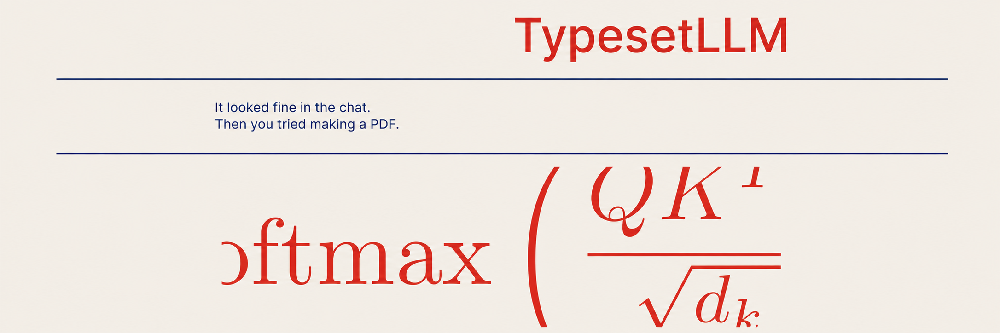

# TypesetLLM

Turns Markdown into a decent PDF. Uses Pandoc and XeLaTeX.

There is a hosted MCP server, a command-line tool, a small web interface, and an HTTP API.

## Connect from Codex

```sh
codex mcp add typesetllm --url https://typesetllm.onrender.com/mcp
```

Check with `codex mcp list`, then reconnect or start a new Codex session if needed. Ask: “Use TypesetLLM to convert report.md into a PDF and save it here.” TypesetLLM renders on its server and returns a temporary HTTPS link; the client downloads the PDF into its workspace. See the [integration guide](https://typesetllm.onrender.com/integrations) and [MCP details](mcp/README.md).

## Requirements

- Python 3.11+
- Pandoc
- XeLaTeX

Docker includes everything.

## Install

```sh
python -m venv .venv
. .venv/bin/activate
pip install -r requirements.txt
```

## Run

```sh
python run_local.py
```

Open <http://localhost:8000>.

## Convert a file

```sh
./convert.sh document.md document.pdf
```

Or:

```sh
python -m src.cli document.md -o document.pdf
```

## HTTP API

```sh
curl -X POST http://localhost:8000/convert \
  -H 'Content-Type: application/json' \
  -d '{"markdown_text":"# Hello"}' \
  --output hello.pdf
```

Useful endpoints:

- `POST /convert` — make a PDF
- `POST /mcp` — Streamable HTTP MCP
- `GET /integrations` — MCP setup guide
- `GET /health` — process check
- `GET /ready` — renderer check

Raw TeX is disabled on the web service. The local command-line tool accepts it for trusted files.

## Docker

```sh
docker build -t typesetllm .
docker run --rm -p 8000:8000 typesetllm
```

The included `render.yaml` can be used to deploy the same image on Render.

## Tests

```sh
python -m pytest -q
```

## Notes

- Maximum web request size: 1 MB by default.
- Conversions time out after 45 seconds by default, including MCP calls.
- Mermaid diagrams are not rendered.
- MCP PDFs are temporary and expire after 15 minutes by default. A restart removes them; multiple app instances need shared storage for downloads and coordinated limits.

MIT License.
