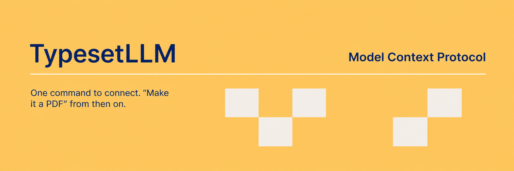

# TypesetLLM MCP

Connect your coding assistant to TypesetLLM and turn Markdown into a PDF. No local setup needed.

## Codex

```sh
codex mcp add typesetllm --url https://typesetllm.onrender.com/mcp
```

Check with `codex mcp list`. Start a new Codex session if the tools do not appear. Then ask: “Use TypesetLLM to convert report.md into a PDF and save it here.”

## Claude Code

```sh
claude mcp add --transport http typesetllm https://typesetllm.onrender.com/mcp
```

See [Claude Code's remote MCP setup](https://code.claude.com/docs/en/mcp#option-1-add-a-remote-http-server).

TypesetLLM renders on its server. The client can download the PDF from a temporary HTTPS link into its workspace. Downloads expire after 15 minutes and may disappear sooner if the server restarts.

The server offers `convert_markdown_to_pdf` and `typesetllm_status`. See the [integration guide](https://typesetllm.onrender.com/integrations) for more detail.

## Optional local adapter

[`server.py`](server.py) is a stdio adapter that calls the hosted `/convert` API and saves PDFs locally. Use it only if you prefer a local MCP process; the remote connection above needs no repository clone or Python dependencies.
